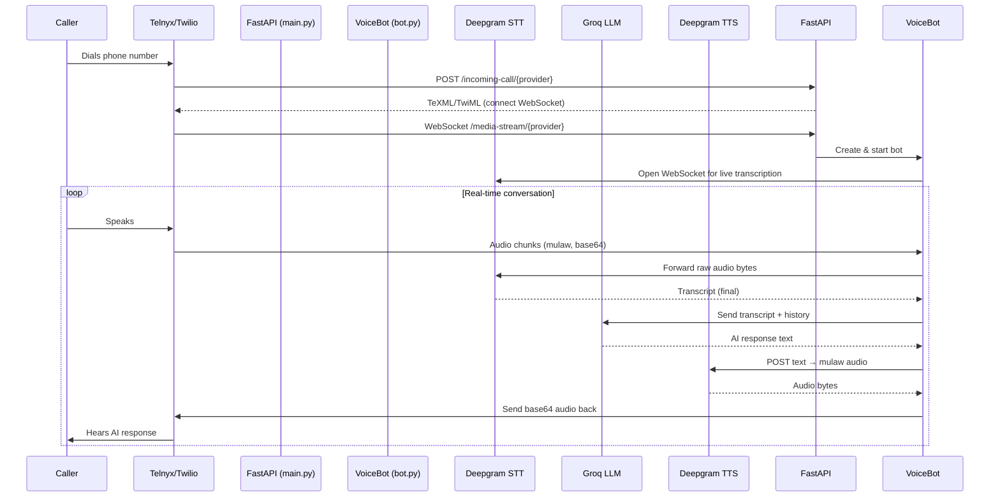

# 🗣️ Real-Time AI Voice Agent

A real-time conversational AI voice agent that handles live phone calls using **Deepgram** for speech processing and **Groq** for lightning-fast LLM responses. Supports both **Twilio** and **Telnyx** as telephony providers through a clean provider-abstraction layer.

> Call a phone number → talk to an AI assistant that responds in real time with sub-second latency.

---

## Architecture



## Key Features

- **Real-time streaming STT** — Deepgram WebSocket with endpointing and utterance detection for natural turn-taking
- **Ultra-low latency LLM** — Groq (`llama-3.3-70b`) for fast, high-quality conversational responses
- **Natural TTS** — Deepgram Aura voice synthesis at 8kHz mulaw for telephony-grade audio
- **Barge-in support** — Users can interrupt the AI mid-response; audio buffer is flushed instantly
- **Multi-provider telephony** — Swap between Twilio and Telnyx via a shared `TelephonyProvider` interface
- **Conversation memory** — Full conversation history is maintained and sent to the LLM for context-aware responses

## Project Structure

```
voice-agent/
├── main.py              # FastAPI server — routes for Twilio & Telnyx webhooks + WebSockets
├── bot.py               # VoiceBot — orchestrates STT → LLM → TTS pipeline
├── system_prompt.py     # System prompt / persona configuration for the LLM
├── providers/
│   ├── __init__.py      # TelephonyProvider abstract base class
│   ├── twilio.py        # Twilio provider implementation
│   └── telnyx.py        # Telnyx provider implementation
├── test_apis.py         # API connectivity tests for Deepgram & Groq
├── arch.mmd             # Architecture diagram (Mermaid)
├── requirements.txt     # Python dependencies
└── .env                 # API keys (not committed)
```

## Tech Stack

| Layer | Technology |
|-------|-----------|
| Server | Python, FastAPI, Uvicorn |
| Speech-to-Text | Deepgram (WebSocket streaming) |
| Text-to-Speech | Deepgram Aura (REST API) |
| LLM | Groq (Llama 3.3 70B) |
| Telephony | Twilio / Telnyx |
| Tunneling | ngrok (for local development) |

## Getting Started

### Prerequisites

- Python 3.10+
- A [Deepgram](https://deepgram.com) API key
- A [Groq](https://groq.com) API key
- A [Twilio](https://twilio.com) or [Telnyx](https://telnyx.com) account with a phone number
- [ngrok](https://ngrok.com) (for local development)

### Installation

```bash
# Clone the repo
git clone https://github.com/Omkarthipparthi/voice-agent.git
cd voice-agent

# Create virtual environment
python -m venv .venv
source .venv/bin/activate   # On Windows: .venv\Scripts\activate

# Install dependencies
pip install -r requirements.txt
```

### Configuration

Create a `.env` file in the project root:

```env
DEEPGRAM_API_KEY=your_deepgram_key
GROQ_API_KEY=your_groq_key
PORT=8080
```

### Running

```bash
# Start the server
python -m uvicorn main:app --reload --port 8080

# In a separate terminal, start ngrok
ngrok http 8080
```

Then configure your Twilio/Telnyx phone number's webhook to point to your ngrok URL:
- **Twilio**: `https://<ngrok-url>/incoming-call/twilio`
- **Telnyx**: `https://<ngrok-url>/incoming-call/telnyx`

Call the phone number and start talking! 🎙️
